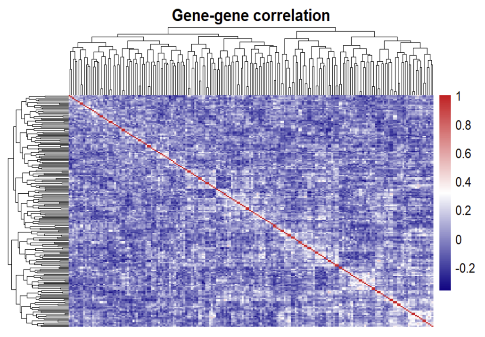

# Cancer Classification Through Genetic Expression

This repository contains code and notes for a project on classifying cancer vs control (healthy) tissue using high dimensional gene expression data. The project compares several supervised learning methods and focuses on an elastic net logistic regression model with cross validated hyperparameters.

## Project Overview

- **Goal**: Predict whether a sample is cancer or control based on thousands of gene expression measurements.
- **Task**: Binary classification (`cancer` vs `control`).
- **Features**: Gene expression values for over 6,000 genes (G1 to approximately G6033).  
- **Models explored**:
  - Naïve Bayes
  - Linear Support Vector Machine (SVM)
  - Elastic Net Logistic Regression with cross validated hyperparameter tuning :contentReference[oaicite:0]{index=0}

The central challenges are the curse of dimensionality (many more genes than samples) and the need for strong regularization and/or feature selection.

## Dataset

- **Name**: `gene`
- **Response variable**: `class`
  - `cancer`
  - `control` (healthy)
- **Predictors**: Gene expression levels for thousands of genes named `G1, G2, …` up to around `G6033`.
- **Train/test split**:
  - 70 percent training data
  - 30 percent test data
  - Example split used in the slides:
    - Train: 71 samples
    - Test: 31 samples

The features are highly dimensional and mostly only weakly correlated with each other; a correlation analysis showed that most pairwise correlations are close to zero, suggesting no severe multicollinearity but a strong risk of accumulating noise from irrelevant genes. Principal Component Analysis (PCA) further highlights the curse of dimensionality and motivates the use of regularization and sparsity.

## Pre Training Analysis

### Correlation Analysis

- Computed a correlation matrix over all gene expression features.
- Most correlations are close to zero.
- Conclusion:
  - No serious multicollinearity problems.
  - However, independence assumptions needed for Naïve Bayes are still not satisfied in a realistic way.

### Principal Component Analysis (PCA)

- Performed PCA to explore low dimensional structure.
- Findings:
  - No single low dimensional projection perfectly separates cancer from control.
  - High dimensionality and sparsity motivate:
    - Strong regularization
    - Feature selection
    - Models that can handle many noisy predictors

## Modeling Strategy

The project compares three main model families:

1. **Naïve Bayes**
2. **Linear SVM**
3. **Elastic Net Logistic Regression**

The general workflow:

1. Load and clean the gene expression data.
2. Split into train and test sets (70/30) with stratification on the outcome.
3. Standardize features on the training set, apply the same transformation to the test set.
4. Train each model on the training data.
5. Evaluate on the held out test data using accuracy, misclassification rate, F1, and sensitivity (for cancer).

### 1. Naïve Bayes

- Motivation: Very fast and simple baseline.
- Assumption: Conditional independence of genes given the class.
- Reality: Although pairwise correlations are small, genes are not truly independent in a way that supports a strong Naïve Bayes assumption in this setting.
- Observed issues:
  - The model tends to accumulate noise from thousands of weak or irrelevant features.
  - Performance:
    - Misclassification rate around 29 percent
    - Accuracy around 71 percent

This makes Naïve Bayes a useful baseline but not competitive for final model choice.

### 2. Linear SVM (Ridge style)

- Implementation: Linear SVM with ridge style penalty (as in `e1071` for R).
- Experiments:
  - Attempt 1: Train only on the top 2 most informative genes.
  - Attempt 2: Train on all ~6,000 genes with cost parameter tuning.
- Observations:
  - Ridge penalty alone is often too gentle in ultra high dimensions.
  - Keeping only 2 genes loses too much information.
- Example performance from the slides:
  - **Full model**:
    - Misclassification rate about 25.8 percent
    - Accuracy about 74.2 percent
  - **2 gene model**:
    - Misclassification rate about 32.3 percent
    - Accuracy about 67.7 percent

The SVM improves slightly over Naïve Bayes but does not fully solve the dimensionality and sparsity problem.

### 3. Elastic Net Logistic Regression

Elastic net logistic regression is the main model of interest in this project.

- **Why elastic net**:
  - Combines the strengths of:
    - L2 (ridge) penalty: helps with stability in high dimension.
    - L1 (lasso) penalty: drives many coefficients exactly to zero and performs feature selection.
  - Particularly well suited to gene expression data where only a subset of genes is truly predictive.

- **Model form**:
  - Logistic regression (binomial outcome, cancer vs control).
  - Elastic net penalty controlled by:
    - `alpha` (mixing parameter between L1 and L2)
    - `lambda` (overall regularization strength).
  - Hyperparameters chosen by cross validation.

- **Key results from the slides**:
  - Elastic net logistic regression selected a sparse model with **262 genes** having non zero coefficients.
  - Example influential genes:
    - **Top positive gene**: `G1720`
      - Log odds coefficient ≈ 0.1203
      - Odds ratio ≈ 1.12
      - Interpretation: each unit increase in expression of `G1720` is associated with about a 12 percent increase in the odds of being cancer, holding other genes fixed.
    - **Top negative gene**: `G364`
      - Log odds coefficient ≈ −0.1129
      - Odds ratio ≈ 0.89
      - Interpretation: each unit increase in `G364` is associated with about a 10 percent decrease in the odds of being cancer, holding other genes fixed.
  - The elastic net model provides a good tradeoff between accuracy and interpretability and is used as the final model.  

